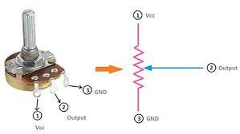

# DC motor speed control using Arduino

## Introduction
The speed of a DC motor can be controlled with the help of a microcontroller such as Arduino using the PWM feature available with it. The manual input in order to control the speed is given to the microcontroller board with the help of a potentiometer.THe microcontroller then providdes a PWM signal to a motor driver which then drives a dc motor at the required speed

## Overview of few terms
### 1. Potentiometer
<p>Potentiometer is a simple mechanical device which provides varying amount of resistance when its shaft is turned.When a voltage is applied across Vcc and GND pin of the potentiometer, it acts as a voltage divider.The voltage taken out from output pin can be varied by varying the potentiometer resistance.This output can be given to any of the analog pins of a microcontroller such as arduino and can act as a manually controlled signal.</p>
<p align="left">
  
</p>

### 2. PWM
<p>Which stands for pulse width modulation is a process of varying the time for which a pulse remains ON. This way the average power delivered by a signal can be controlled. The longer the pulse remains ON compared to its OFF time, the higher the total power supplied to the load.</p>
<p>Duty cyle represents the proportion of ON time of a pulse to its total time period. It is represented in percentage.</p>
</br>
<p align="left">
  
</p>
</br>
An Arduino uno has 6 PWM output pins (3,5,6,9,10,11) labeled with ~ sign. PWM signals can be given using the in-built function "analogWrite()" in Arduino IDE.
</br>

### 3. L298N
<p>L298N is a dual channel motor driver. The H bridge is used to control the direction of the motors by provding HIGH(1) and LOW(0) signals to the direction control pins (IN1,IN2,IN3,IN4).The speed can be controlled by proving PWM signals to these pins.</p>
<p align="left">
  
</p>


## Components and supplies
<ul>
<li>Arduino Uno X 1</li>
<li>DC motor(generic) X 1</li>
<li>Jumper wires(generic) X 1</li>
<li>Potentiometer - 10k ohms X 1</li>
<li>L298N motor driver X 1</li>
<li>USB A to B cable X 1</li>
</ul>

## Circuit diagram
<p align="left">
  
</p>


## Working 
<p>The voltage at the ouput pin of the potentiometer is varied by turning the potentiometer's shaft The output voltage is fed into arduino as analog input at pin A0 of arduino.The "analogRead()" function is used to read the votage at the pin.</p>
<p>The arduino has a Analog to Digital converter or ADC which convert this analog input to a value in the range <strong>0 to 1023</strong>. This value is mapped to a value in the range <strong>0 to 255</strong> using "map()" function. The mapped value is fed as PWM output to the L298N motor driver at pin4 which in turn drives the dc motor connected to the output pins of the driver. The speed of the motor varies as the potentiometer value is changed.</p>

## Code
Code used to program the arduino
<details>
<summary>Click to expand code...</summary>
<p>

```c++
void setup() {
  Serial.begin(9600);
  pinMode(4,OUTPUT); // output pin to driver 
  digitalWrite(4,LOW); // normally LOW in this pin
  pinMode(A0,INPUT);  // output of 10k potentiometer
}

void loop() {
  int s=analogRead(A0); // read ouput value from 10k Potentiometer
  int z=map(s,0,1024,0,255); // map the potentiometer ouput to a PWM value
  analogWrite(4,z); // give PWM signal at pin 4
}

```

</p>
</details>

## Resources
Potentiometer:https://docs.arduino.cc/built-in-examples/basics/AnalogReadSerial
</br>
PWM:https://create.arduino.cc/projecthub/muhammad-aqib/arduino-pwm-tutorial-ae9d71
</br>
L298N:https://lastminuteengineers.com/l298n-dc-stepper-driver-arduino-tutorial/